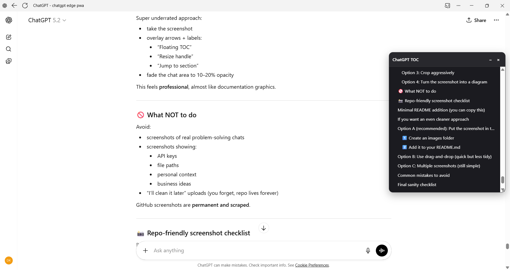
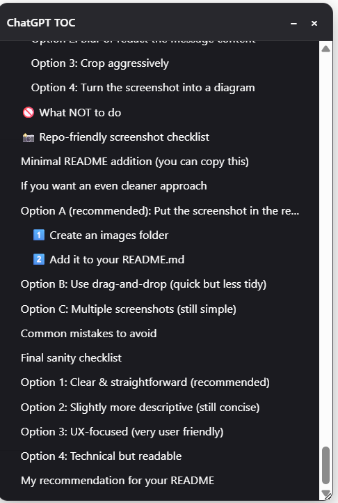
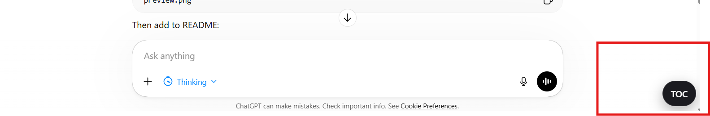
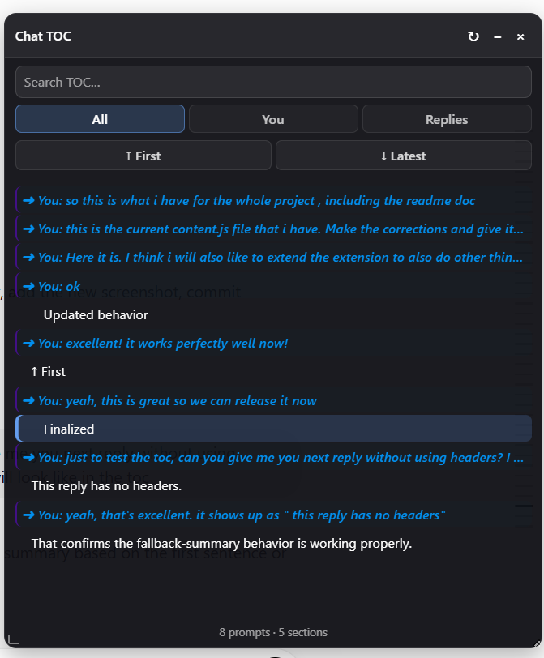

# Web Browser ChatGPT TOC

A lightweight web browser extension that adds a **floating Table of Contents (TOC)** panel to ChatGPT conversations.

Built for long conversations where scrolling becomes inefficient and frustrating.

## Screenshots

### TOC Panel Overview

### Navigation + Highlight Example

### Closed TOC

### Search feature added in v2.1.0

## 

## Features

- Floating TOC panel for ChatGPT conversations
- Includes user prompts and ChatGPT reply sections
- Auto-detects Markdown headings (`h1`–`h6`)
- Smart fallback titles when no headings are present
- Click any entry to scroll to and briefly highlight its source
- Search entries inside the TOC
- Filter by **All**, **You**, or **Replies**
- Highlights the currently visible conversation section
- Displays prompt and section counters
- Manual refresh button
- Detects navigation between ChatGPT conversations
- Live updates while ChatGPT generates or changes a reply
- Draggable panel
- Resizable from bottom-right and bottom-left
- Minimize or close with quick reopen
- Persists panel size between reloads
- No external services, API keys, or build step

## Privacy

- No data collection
- No external requests
- Runs entirely locally in your browser
- No tracking

## Supported browsers and sites

- Firefox
- Chrome
- Microsoft Edge
- `https://chatgpt.com`
- `https://chat.openai.com`

## Installation (Unpacked)

### Edge / Chrome

1. Open `edge://extensions` or `chrome://extensions`.
2. Enable **Developer mode**.
3. Click **Load unpacked**.
4. Select this project folder.

### Firefox

1. Open `about:debugging`.
2. Click **This Firefox**.
3. Click **Load Temporary Add-on**.
4. Select `manifest.json`.

## Updates

### v2.1.0

- Consolidated the working interface styles into `content.css`.
- Removed redundant and conflicting CSS from `content.js`.
- Added TOC search.
- Added **All / You / Replies** filters.
- Added automatic active-section highlighting while scrolling.
- Added prompt and section counters.
- Added a manual refresh button.
- Added **↑ First** and **↓ Latest** conversation navigation.
- Improved **↑ First** so it can continue upward when ChatGPT loads older conversation turns.
- Improved detection when switching between ChatGPT conversations.
- Improved live updates while ChatGPT generates, edits, or regenerates replies.
- Preserved dragging, dual-corner resizing, saved panel size, minimize, close, reopen, smooth navigation, and glowing user-message entries.

### v2.0.0

- Added user messages to the TOC.
- Added visually highlighted `➜ You:` entries.
- Added flexible resizing and saved panel size.
